评分标准：quiz+签到5%，lab 35%，期末60%半开卷

# lec 1: Introduction
### Amdahl's Law
$$Speedup = \frac{1}{(1 - f) + \frac{f}{s}}$$
- **$f$**: 可并行化的部分占总执行时间的比例。
- **$s$**: 并行化部分的加速比。
- **Diminishing Returns**: 随着 $s$ 趋于无穷，Speedup 受限于 $1/(1-f)$。
- 举例：假设执行一个程序需要100min，其中80min可以并行化，20min必须串行执行。
    - 如果使用4个处理器并行化80min的部分，Speedup = 100 / (20 + 80/4) = 100 / (20 + 20) = 2.5。
    - 如果使用8个处理器并行化80min的部分，Speedup = 100 / (20 + 80/8) = 100 / (20 + 10) = 3.33。
    - 当处理器数量趋于无穷时，Speedup = 100 / (20 + 0) = 5。即使有无限的处理器，最大加速比也只能达到5倍。

### Roofline's Model
- **Arithmetic Intensity (AI)**: 每字节内存访问的计算操作数。
    - AI = Total FLOPs / Total Memory Bytes
    - 代表程序对数据的“榨取”程度。如果一个算法处理 1 字节数据要做 100 次运算，它的 AI 就很高（如矩阵乘法）；如果读 1 字节只做 1 次加法，AI 就很低（如向量加法）。
    - AI 越高，程序越可能受计算性能限制；AI 越低，程序越可能受内存带宽限制。

$$Attainable\,Performance = \min(\text{Peak GFLOPS}, \text{Peak BW} \times \text{Operational Intensity})$$
- **Memory Bound（斜线部分）**
    - 当程序的计算强度很低时，性能受限于内存带宽。
    - Throughput = bandwidth * AI
    - 内存提供的数据无法满足处理器的计算需求，导致处理器空闲等待数据。
- **Compute Bound（水平线部分）**
    - 当程序的计算强度很高时，性能受限于硬件峰值算力。
    - Throughput = Peak GFLOPS
    - 数据到位了但算的不够快。

- **Ridge Point**
    - 峰值算力（水平线）和内存带宽限制（斜线）的交点。
    - Ridge Point 的 AI = Peak GFLOPS / Peak BW
    - 脊点越往右，程序对算力要求越高（比如GPU比CPU更靠右）

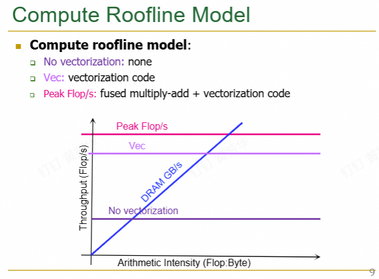
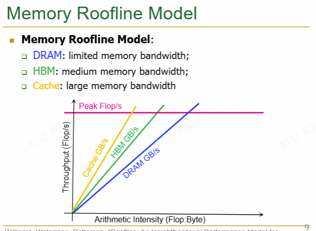

### Little's Law
$$Concurrency (Buffer Size) = Throughput \times Latency$$
$$L = \lambda \times W$$

- $\lambda$: 单位时间进入食堂的学生数，
- $W$: 平均每个学生在食堂的停留时间。
- $L$: 同一时间在食堂的学生总数。
- **存储器带宽与延迟**
    假设你要评估处理器访问显存（DRAM）的效率：
    - $L$：正在进行的内存请求数量（In-flight requests）。
    - $\lambda$：内存带宽（吞吐量，每秒完成多少请求）。
    - $W$：访存延迟（每个请求从发起到完成的时间）。
    - 启示： 如果内存延迟（$W$）很高，为了让吞吐量（$\lambda$）提上去，系统必须支持更多并发的访存请求（$L$）。这就是为什么 GPU 需要成千上万个线程来“掩盖访存延迟”。

### Von Neumann Model
- Components:
    1. Control Unit: 负责指令的获取、解码和执行控制。
    2. Processing Unit: 执行算术和逻辑运算,如ALU。
    3. Memory: 存储指令和数据。
    4. Input/Output: 与外部设备进行通信。

- 2 key features:
    1. Stored program
    2. Sequential execution

# lec 2: Pipeline Hazards and Reorder Buffer
### Pipeline Hazard
- **Data Hazard**: 指令间数据依赖导致的冲突。
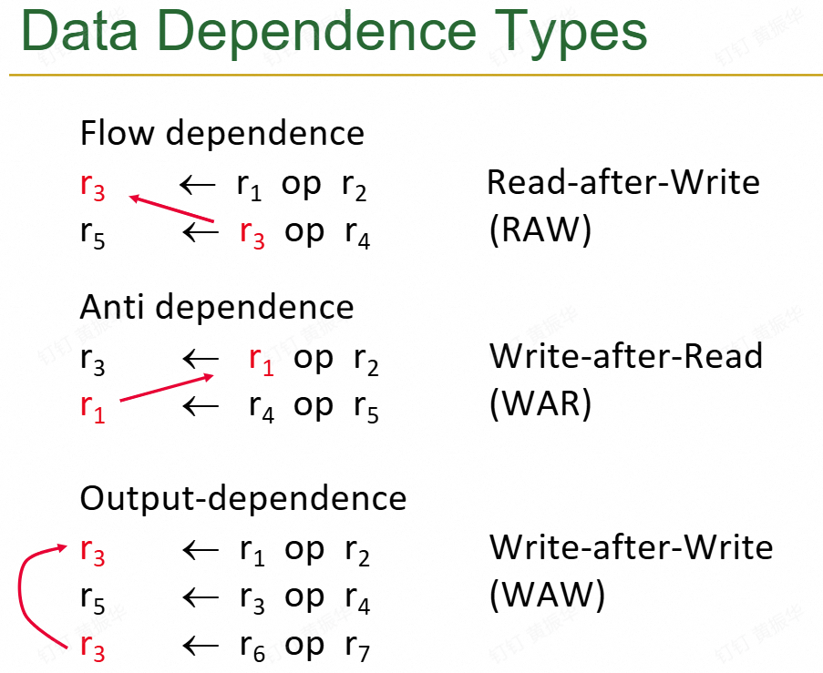
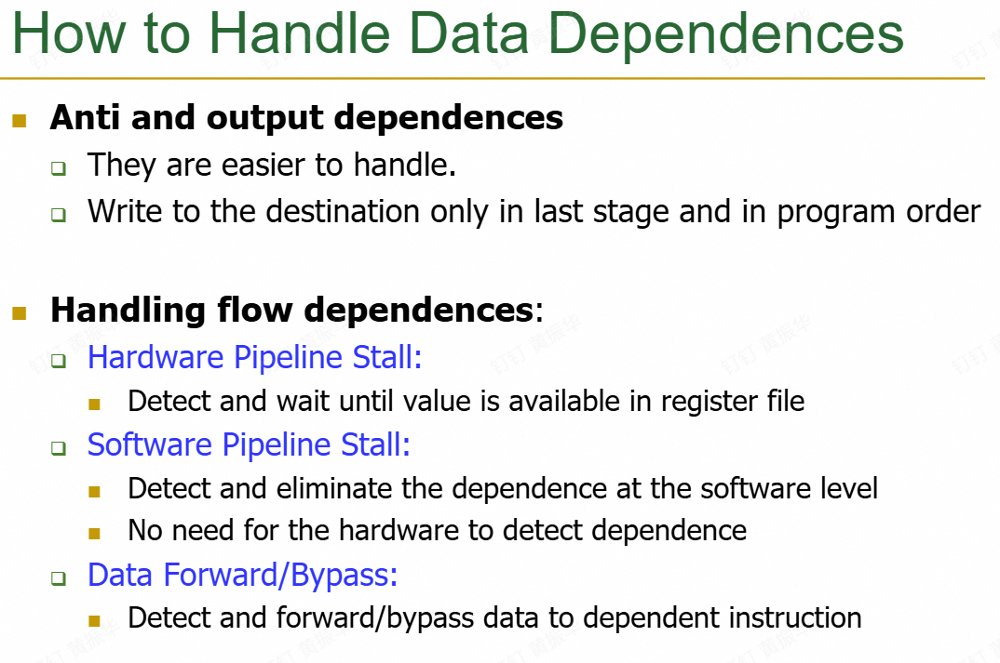
- **Control Hazard**: 分支指令导致的控制流不确定性。
- **Structural Hazard**
    - **Reasons:** Occurs when two or more instructions try to use the same hardware resource in the same cycle.
    - **Solutions:**
        1. 增加硬件资源
        2. Stall：暂停指令执行，直到资源可用。
        3. 重排指令：调整指令顺序以避免资源冲突。
        4. 允许同时访问：设计允许多个指令同时访问资源的硬件（寄存器、内存（指令和数据接口分开））。
        5. 流水线分段：将功能单元分成多个阶段，每个阶段处理不同的指令部分。

### Reorder Buffer
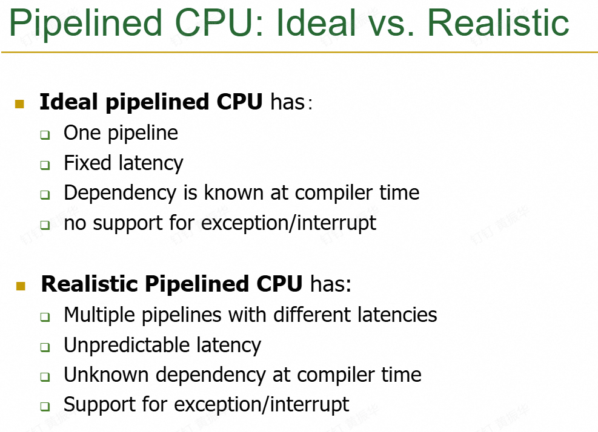
#### For Multicycle Execution
- 问题：耗时长的指令（如乘法、内存访问）可能需要多个周期完成。
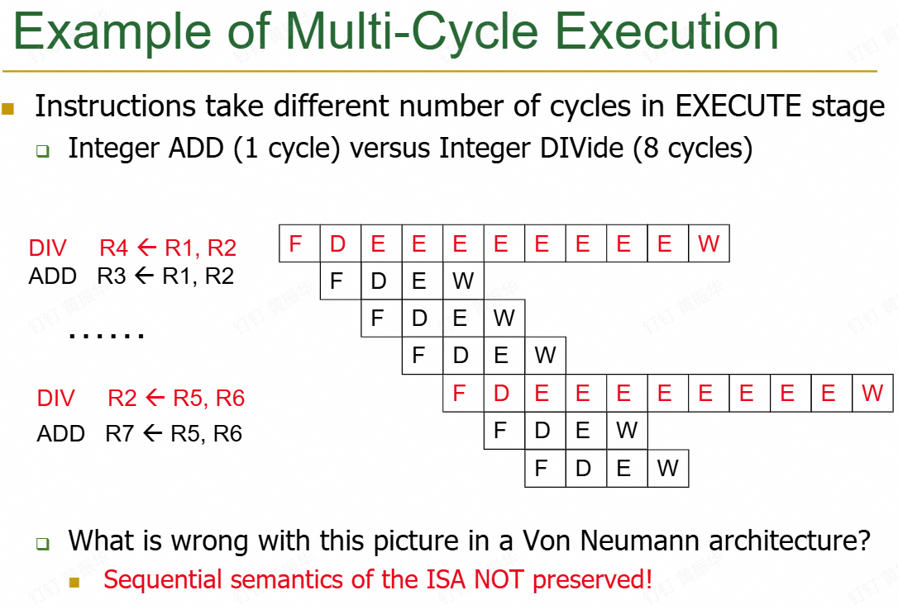

#### For Exceptions and Interrupts
- 问题：异常和中断可能在指令执行过程中发生，需要确保程序状态的一致性。
    1.  精确异常（Precise Exception）困难：
        - 如果指令 B 在指令 A 之前完成并修改了状态，而指令 A 随后发生了异常（如除零），CPU 将无法回滚到指令 A 执行前的状态，因为 B 的结果已经“覆盖”了旧值。
    2. 分支预测失败：
        - 如果 CPU 预测错了分支并提前执行了后面的指令，必须有一种机制能撤销这些指令对机器状态的影响。
- Both e. and i. require:
    1. stop the current program
    2. save the architectural state
    3. handle the event
    4. turn back to program execution (restore state)
    越复杂的CPU，处理异常和中断的机制越复杂。
- 为了确保流水线的正确性，需要对齐不同指令的周期数。

#### For False Dependency
- 问题：指令之间存在假依赖（如反依赖和输出依赖），可能导致指令无法乱序执行。

#### Reorder Buffer
- key idea: 乱序完成指令，但是顺序写回寄存器/内存（提交）
    1. 顺序解码指令，分配ROB entry
    2. 乱序执行指令，完成后将结果写入ROB entry
    3. ROB中最老指令完成且没有发生异常时，提交指令结果到寄存器/内存（顺序提交）
    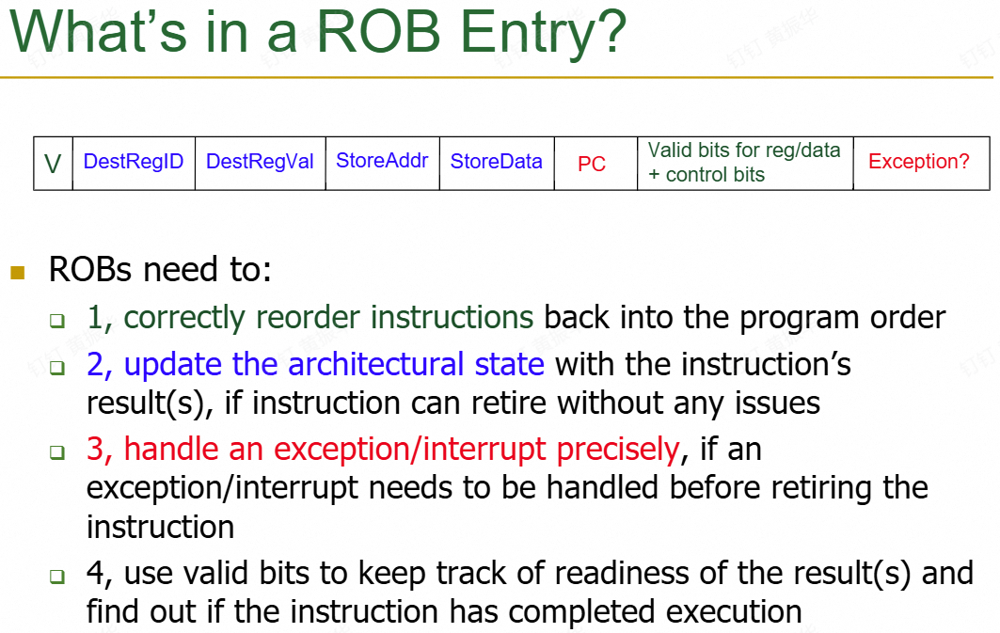
- 解决了数据冒险和控制冒险问题，同时支持异常处理。

- Simplify ROB access: Use indirection
    1. access register file first (check if valid)
        - if not, 寄存器储存 ROB 编号，编号对应的 ROB entry 存储指令结果，相当于将寄存器重命名为 ROB entry。
        - if valid, 直接使用寄存器值

    2. access ROB next
        - 当指令完成时，将结果写入对应的 ROB entry，并标记为 valid。
        - 当 ROB 队首指令标记为 valid 时才能提交：
            - 将结果从 ROB 写回寄存器或内存。
            - 释放 ROB entry。
            - 如果队首指令发生异常，清空 ROB ，撤销所有未提交任务，处理异常。

- ROB 身份：
    1. 结果的暂存器：在指令正式生效前，结果保存在 ROB entry 中。
    2. 寄存器重命名的延伸：寄存器编号被重命名为 ROB entry 编号，后者存储该寄存器的最新值。
        - 假装有很多寄存器，消除了寄存器之间的假依赖。

#### False Dependency
- flow dependency: 真实数据依赖，必须保持指令顺序。
- anti-dependency: WAR
- output dependency: WAW
为了解决false dependency，#reg 应该小于 #ROB entries。

#### ROB tradeoffs
- advantages: 
    1. 为解决精确异常问题提供简单机制
    2. 消除假依赖，支持更大程度的乱序执行
    3. 提高指令级并行性和性能
- disadvantages:
    1. 增加硬件复杂性和成本。
    2. 需要更多的寄存器和缓冲区资源。
    3. 可能增加指令提交的延迟。

ROB可以提高实际算力，但不一定提高理论峰值算力，因此不会影响Roofline模型中的Peak GFLOPS。

# lec 3: Tomasulo's Algorithm
### In-order Pipeline with only ROB
- 顺序分发（dispatch）指令，乱序完成（complete）指令，顺序提交（commit）指令。
- 可以消除因为寄存器名字不够用带来的虚假相关（WAW、WAR）
- 但是真数据相关（RAW）会直接将整条流水线在译码/分发阶段卡死，即使后面的新指令和当前卡住的指令没有数据依赖，也无法越过当前指令去执行。
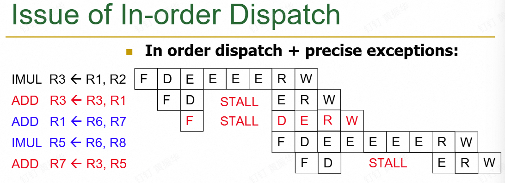

### Reservation Station
- idea: 将有依赖的指令放在一个缓冲区（reservation station）中，没有依赖的指令可以直接绕过它们去执行。
- function: 
    1. 存储指令和操作数
    2. 监视操作数的可用性
    3. 当所有操作数可用时，发出指令执行
- benefits: 允许没有依赖的指令绕过高延时指令执行。
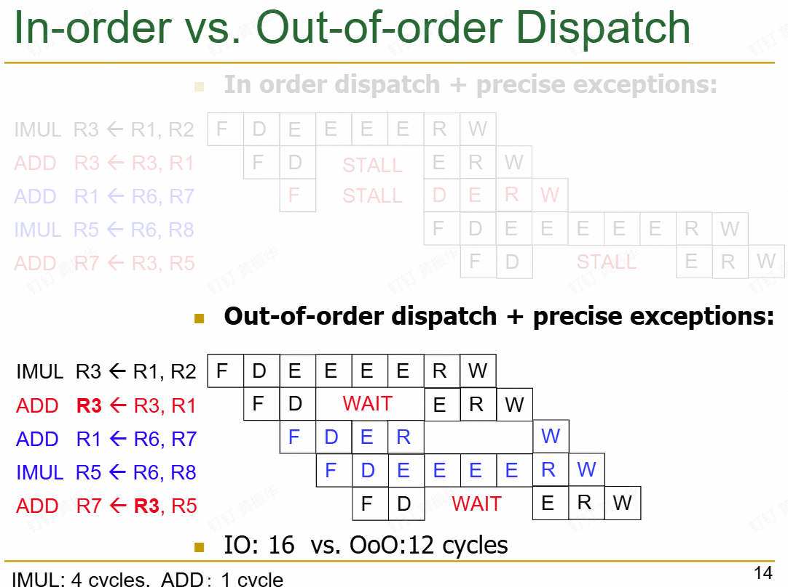

### Tomasulo's Algorithm
- Hump 1: Reservation Station（顺序发射、乱序分发）
- Hump 2: Reorder（乱序完成，顺序提交）
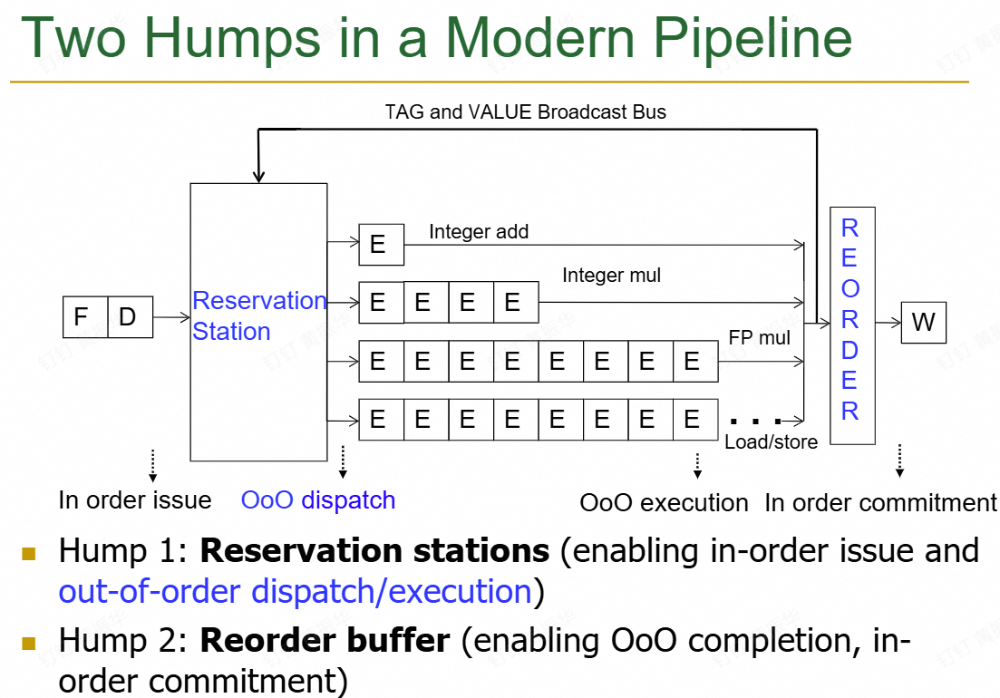

#### Enabling OoO Execution
1. **Register renaming**: 链接数据的生产者和消费者，消除假依赖。Associate each data value with a unique tag (ROB entry).
2. **Reservation Stations**: 提供缓冲区来存储待执行的指令。
3. **Common Data Bus (CDB)**: 指令需要跟踪它们的操作数何时可用。
    - 指令完成时，通过 CDB 广播 tag
    - 指令将他们的 tag 与 CDB 上的 tag 进行比较，如果匹配则获取结果并标记为 ready。
4. **Dispatch**: 如果指令的所有操作数都 ready，则将它分发到 functional unit 执行（Instruction wakes up）。
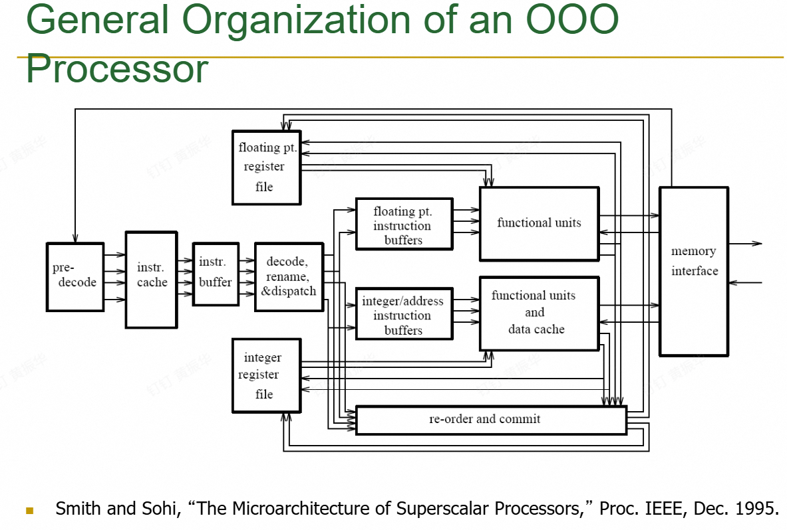

#### Register Renaming
- 目标寄存器被重命名为 Reservation Station 或 ROB entry，消除假依赖。

#### Three Components of Tomasulo's Algorithm
1. **Register Rename Table** （或 Register Alias Table）：跟踪每个寄存器当前被哪个 ROB entry 占用。
2. **Reservation Stations**：每个功能单元有一个或多个预留站，存储指令和操作数。
3. **Common Data Bus (CDB)**：指令完成时广播结果，其他指令监听 CDB 以获取操作数。
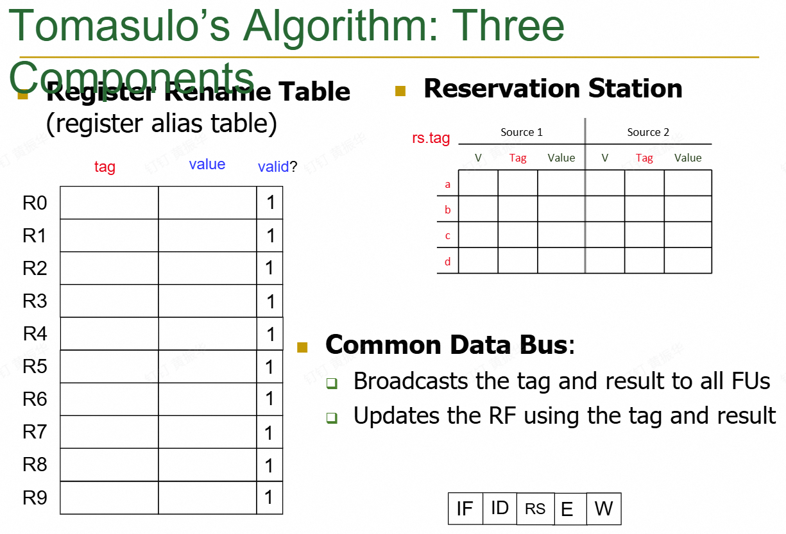

#### 执行过程
1. **ID**:
2. **RS**:
3. **EXE**:
4. **WB**:
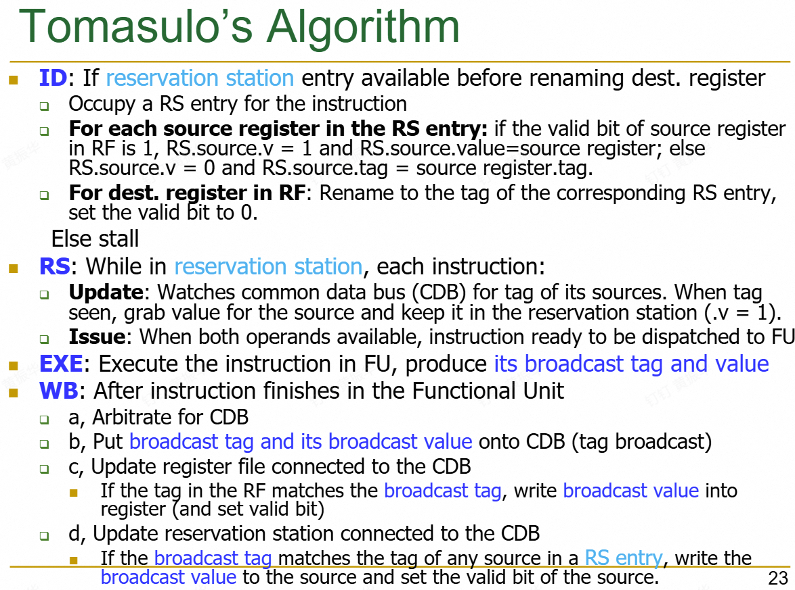

### Summary of OoO Execution
1. 寄存器重命名消除假依赖，链接生产者与消费者。
2. RS 的 Buffering 允许流水线先执行没有依赖的指令。
3. 广播机制确保指令在操作数准备好时被唤醒执行。
4. Wakeup 和 select 允许乱序分发。

### Modern OoO Execution with Precise Exception
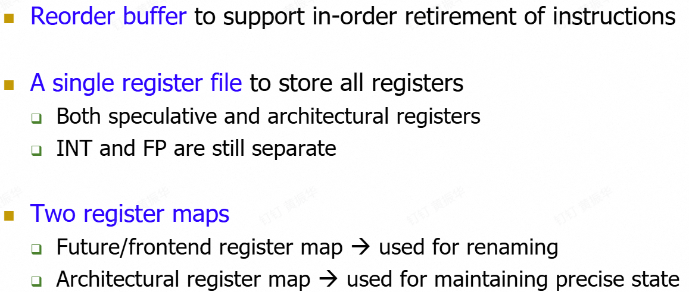

### Questions to Ponder
- OoO execution 提升性能（Latency tolerance）主要通过允许独立指令先执行。
- 如果一条指令持续周期很长，将需要非常大的 Instruction Window
    - Instruction Window: all decoded but not yet retired instructions
    - 受 ROB 和 RS 大小限制
- 现代CPU的Instruction Window通常在几十到几百条指令之间。

### Dependence Detection
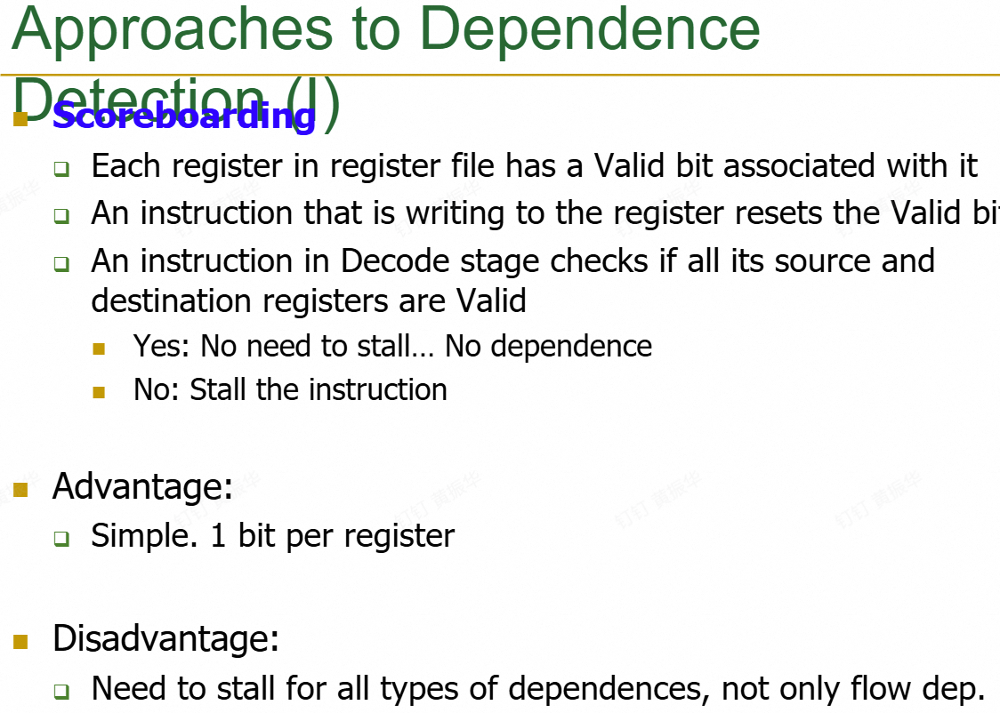

# lec 4: Superscalar
### Superscalar
- idea: fetch, decode, execute, retire multiple instructions per cycle
    - N-wide superscalar: 每周期最多发出N条指令
- issues:
    - hardware resources
    - 需要由硬件来检测指令间的依赖关系
- superscalar and OoO execution are orthogonal（正交）: 可以有四种组合：[in-order, out-of-order] x [scalar, superscalar]

#### Inorder Superscalar
- idea: Multiple copies of data path, fetch and decode multiple instructions per cycle, but execute and retire in order.
- ideal IPC = N

#### Superscalar Execution Tradeoffs
- advantages: higher instruction throughput, higher IPC
- disadvantages: 
    1. More hardware resources needed (multiple fetch/decode/execute/retire units)
    2. higher complexity in handling hazards and dependencies
        - 需要在一个周期内检测多个指令之间的依赖关系
        - 对于乱序执行的处理器，寄存器重命名困难
        - 可能增减延迟从而增加时钟周期

- superscalar 技术对于 Roofline Model 的影响
    - Peak GFLOPS: 通过增加执行单元数量，superscalar 可以提高处理器的峰值算力（水平线提高）。
    - Memory Bandwidth: Superscalar 本身不直接影响内存带宽（斜线斜率不变），但更高的指令吞吐量可能会增加对内存的需求，如果算力上限提高了但是带宽没有提升，程序可能从 Compute-bound 降级为 Memory-bound。

### Vector Insn
- SISD: Single Instruction, Single Data
    - 在指令和数据都没有并行
    - 比如我们设计的单周期流水线
- SIMD: Single Instruction, Multiple Data
    - 同一指令作用于多个数据元素，适用于数据并行任务。
    - Array/vector processor
    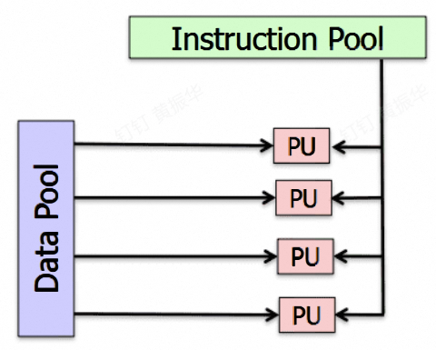
- MISD: Multiple Instruction, Single Data
    - Historical significance, Systolic array, stream processing
    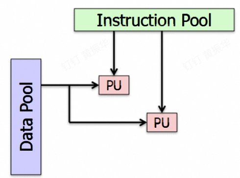
- MIMD: Multiple Instruction, Multiple Data
    - 利用多个异步、独立的处理器达到并行
    - 不同处理器可以执行不同的指令流
    - Multiprocessor, Multithreaded processor
    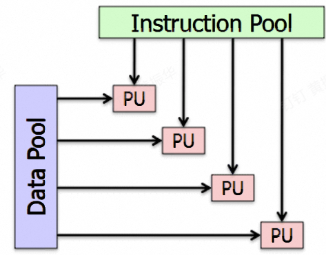

#### SIMD Applications and Implementations
- Applications: 图像处理、科学计算、机器学习等(Matlab, NumPy)
- Implementations: X86、ARM、RISC-V vector extension

#### Limitations
- 没有维持计算和内存访问之间的平衡，可能导致带宽成为瓶颈
- 数据没有被合适地映射到 Memory bank
    - Memory bank：内存被分成多个独立的部分，每个部分可以同时访问。如果多个数据元素映射到同一个 Memory bank，就会发生冲突，导致性能下降

#### How to support SIMD
- Memory: 需要支持同时访问多个数据元素的内存系统（Memory bank）
- Register: vector regfile,每个寄存器可以存储多个数据元素

### Multithreading
*ver 1.：*
- idea: 在单个CPU核心上同时执行多个线程。
    - 已取指令完成之前，不从同一线程中取新的指令
    - Branch/Instruction resolution latency overlapped with execution of other threads.

    - 同一个线程中不需要额外添加控制逻辑和处理数据依赖
    - 单线程性能受影响
    - 保存 thread context 需要额外逻辑
    - 如果没有足够多的 thread 来隐藏延迟，性能提升有限

*ver 2.：*
- idea: 每个周期都切换线程，同一个线程的不同指令不会同时在流水线中
    - Tolerates the control and data dependency latencies by overlapping the latency with useful work from other threads
    - Improves pipeline utilization by taking advantage of multiple threads

**Fine-grained multithreading**:
- advantages:
    - 不需要检查依赖
    - 不需要分支预测
    - bubble 可以被其他线程的指令填充
    - 提高吞吐率，隐藏延迟，提高资源利用率
- disadvantages:
    - 额外硬件复杂度：多线程上下文、调度逻辑
    - 单线程性能下降：每 N 周期执行一个线程的指令
    - 不同线程会竞争 cache 和 memory
    - 不同线程间 load/store 可能会存在数据依赖

- Multithreading 对 Roofline Model 的影响
    - Peak GFLOPS: 并没有增加计算单元数量，理论最高算力不变
    - Memory Bandwidth: 不改变
    - 让实际运行点逼近屋顶

### Multi-core
- idea: 在单个芯片上集成多个CPU核心，每个核心可以独立执行线程。
- advantages: 
    - 单核更简单：能效更高，设计和复制更简单，频率更高
    - 在多线程工作中吞吐量更高：减少线程切换的开销
- disadvantages: 
    - 需要并行任务来提高性能
    - 资源共享可能降低单个线程的性能
    - 共享的硬件资源需要管理
    - number of pins limits data supply for increased demand

#### 为什么多核优于 large superscalar？
- technology push：
    - Insn issue queue size 限制 superscalar/OoO processor 的时钟周期
    - 需要很大的 multi-ported regfile 来支持更大的 insn window

- application pull：
    - CPU上运行多个 applications，所以自然需要多核

- multi-core 对 Roofline Model 的影响
    - Peak GFLOPS: 通过增加核心数量，multi-core 可以提高处理器的峰值算力（水平线提高）。
    - Memory Bandwidth: 多核处理器通常需要更高的内存带宽来支持多个核心的并行访问，如果内存带宽没有相应提升，可能会导致性能瓶颈。

    - 算力提升一般远大于带宽提升，ridge point 右移

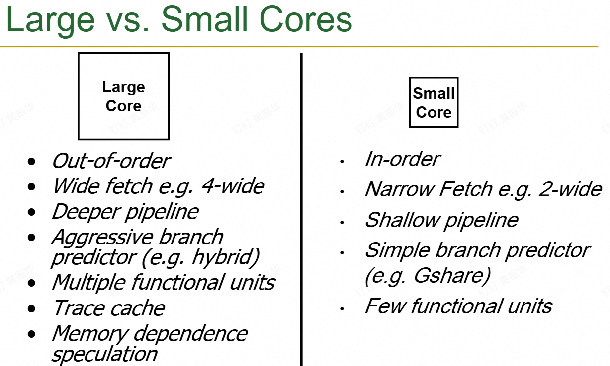

#### Get best of both worlds
- tile large: 在单线程、序列化任务上性能更好；在并行任务上吞吐量低
- tile small: 在并行任务上吞吐量更好；在单线程、序列化任务上性能较差

- idea: 在同一个芯片上同时集成大核和小核
    - Asymmetric Chip Multiprocessor (ACMP)
    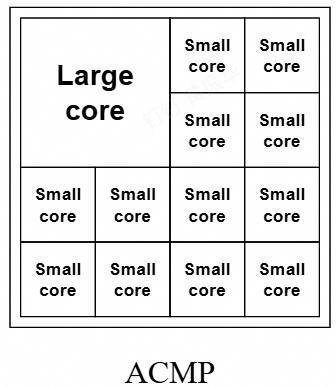
        - accelerate serial part using the large core
        - execute parallel part on all cores for high throughput

# lec 5: Memory
### Ideal Memory
- Zero latency
- Infinite capacity
- Infinite bandwidth
- Zero cost

- Problems:
    - Bigger is slower
    - Faster/Higher bandwidth is more expensive
    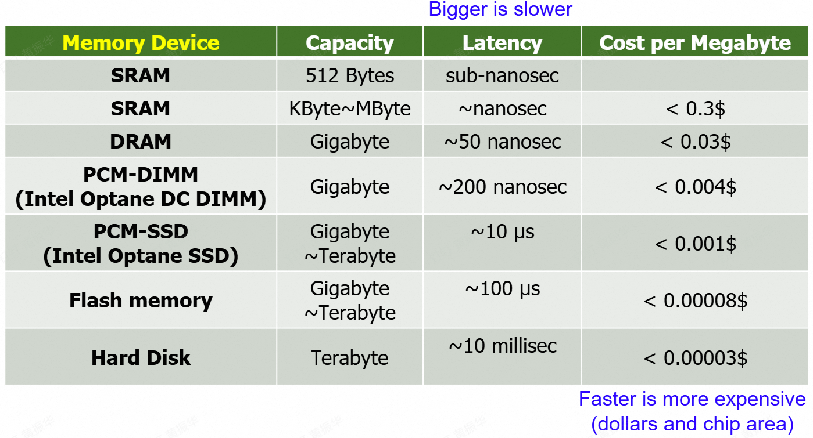

- Comparison of memories:
    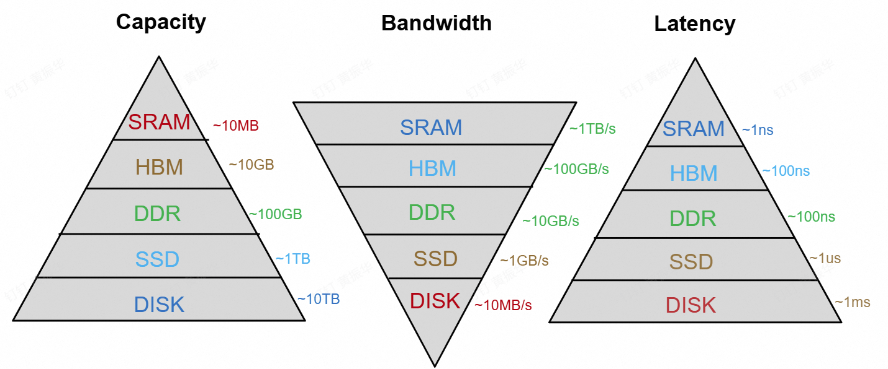

### FF vs. SRAM vs. DRAM vs. SSD
|存储介质|典型容量量级|访问特性与速度|成本与性价比|物理结构 / 制造工艺特征|
|---------|------------|--------------|------------|------------------|
|Flip-Flops (FF / 触发器)|~K (千字节级别，如寄存器堆)|极快 (Very fast)，支持高并发的并行访问 (Parallel access)|极度昂贵 (Very expensive)|一个位（Bit）的存储需要消耗数十个晶体管|
|Static RAM (SRAM / 静态内存)|~M (兆字节级别，如高速缓存 Cache)|相对较快 (Relatively fast)，但每个时钟周期只能访问一个数据字|昂贵 (Expensive)|一个位（Bit）的存储需要消耗 6 个以上晶体管|
|Dynamic RAM (DRAM / 动态内存)|~G (吉字节级别，如系统内存/显存)|慢 (Slow)，单次只能访一个字；且读取会破坏内容（每次读后需自动刷新）|便宜 (Cheap)|工艺特殊，一个位（Bit）的存储只需要 1 个晶体管 + 1 个电容|
|Flash Memory (闪存 / SSD)|~T (太字节级别，如固态硬盘/非易失存储)|慢得多 (Much slower)，访问需要耗费较长时间；具有非易失性|极度便宜 (Very cheap)|一个晶体管可存储 16 位，或者甚至不需要传统晶体管参与|

### SRAM
- Memory Array:
    - Bitline: 连接每一列的线，用于读写数据
    - Wordline: 连接每一行的线，用于选择要访问的行
    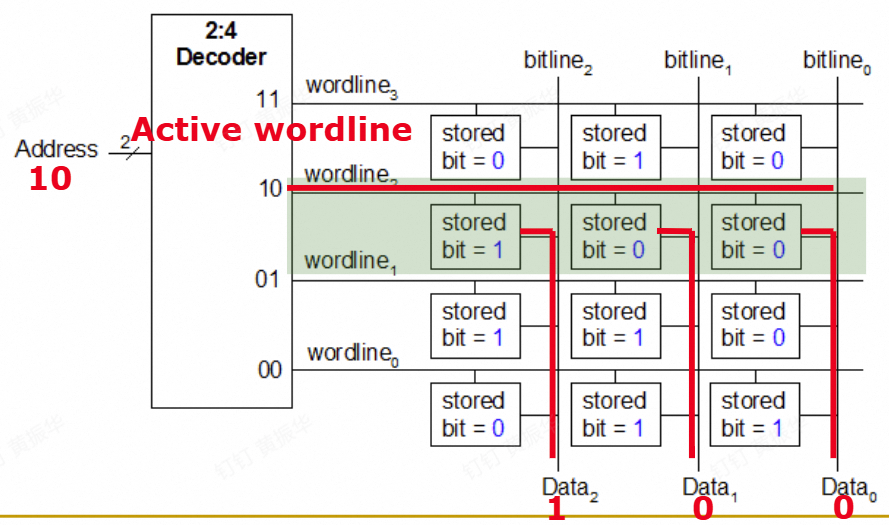

- A SRAM Bit
    - 4 transistors for storage (cross-coupled inverters)
    - 2 transistors for access
    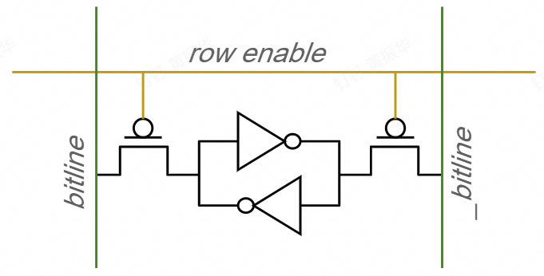

#### Summary of SRAM
1. SRAM
    - Goal: buffering data on chip to reduce external memory traffic
    - Advantages: fast access, low latency, high bandwidth
    - Disadvantages: expensive, low capacity

2. Where to use
    - Cache in CPU
    - Shared memory in GPU
    - On-chip buffer in AI accelerator

3. How to use
    - Multiple small seperate SRMAs: low latency, hight throughput
    - Banked design: wide access port

#### Memory Banking
- idea: 将内存分为多个独立的 bank，每个 bank 可以被独立访问；bank之间共享地址和 data bus（to minimize pin cost）
- 如果访问的地址被映射到 N 个不同的 bank 上，可以同时访问 N 个数据元素，达到 N 倍的带宽。

#### SRAM Read sequence
1. Address decode（地址译码）：地址信号输入，Row/Col 译码器开始工作，定位具体的行列。
2. Drive row select（驱动行选择）：将选中的那条 row enable（字线）电位拉高。
3. Selected bit-cells drive bitlines（位线驱动）：被选中的整行 bit-cell 开始放电，改变垂直位线（$bitline$ / $\overline{bitline}$）的电压。
4. Differential sensing and column select（差分放大与列选）：Sense Amp 检测到两条位线之间的微小电压差并将其放大，同时 Column Mux 选出目标数据，此时 Data is ready（数据就绪）。
5. Precharge all bitlines（位线预充电）：在下一次读写前，必须把所有 $bitline$ 的电位重新拉回到高电平（预充电），为下一次“拉低电位”的检测做好准备。

- 性能瓶颈分析（Access & Cycling Latency）：
    - 访问延迟（Access Latency）：主要死在 Step 2 和 Step 3。因为字线和位线都非常长（横跨数百万个单元），带有很大的寄生电容，电位拉高和放电都需要物理时间。
    - 周期时间（Cycling Time）：指两次独立读操作之间必须隔开的最短时间。它由 Step 2, 3 和 5 共同主导。如果预充电（Step 5）没做完，就绝对不能发起下一次读取。
    - 定量关系：
        - 步骤 2 的延迟与列数（$2^m$）成正比（行线越长，电容越大，驱动越慢）。
        - 步骤 3 和 5 的延迟与行数（$2^n$）成正比（位线越长，放电和预充电越慢）。

#### CPU 芯片的很大一部分面积被 SRAM 占用
- 现代 CPU 芯片中，SRAM 占据了大约 50%

### DRAM (HBM/DDR)
#### Memory Becomes Bottleneck for Computing
- Memory 大小、带宽、访存速度都成为性能瓶颈
- Memory 耗能极大（整数加法的6400倍）；整个系统的60%能耗来自 data movement

#### DRAM Bit
- 1 transistor + 1 capacitor
- 通过电容存储电荷来表示数据位（0 或 1）
- Capacitor 需要定期刷新（refresh）以保持数据完整性，因为电荷会泄漏
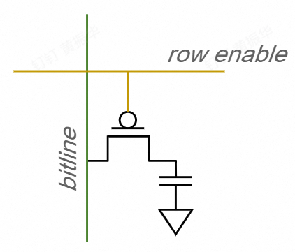

#### Building Larger Memory
- Challenge: Larger -> Slower
- Idea: 将内存分成多个 smaller arrays，interconnect them to i/o bus
    - hierarchical array structures
    - DRAM: Channel -> Rank -> Bank -> Subarray -> Mat

- Issue: How to map data to different banks

#### DRAM Subsystem Organization
- Channel:
- DIMM: Dual Inline Memory Module
    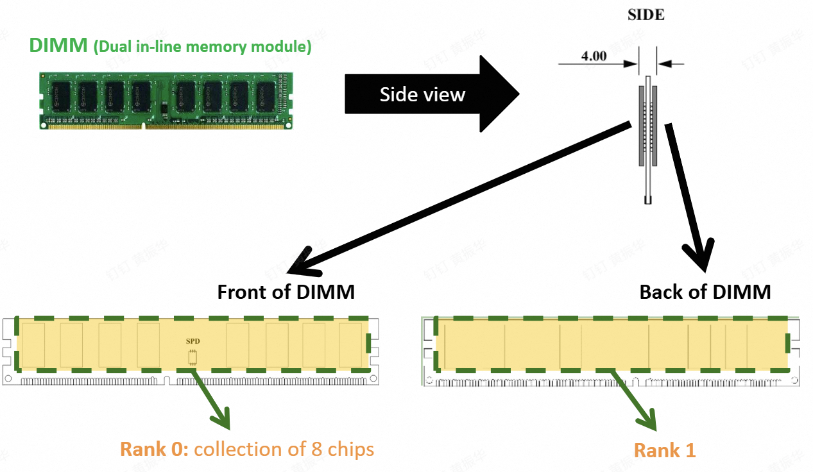
- Rank: 
    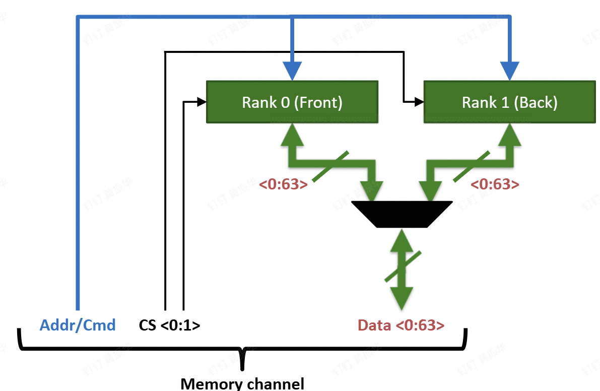
    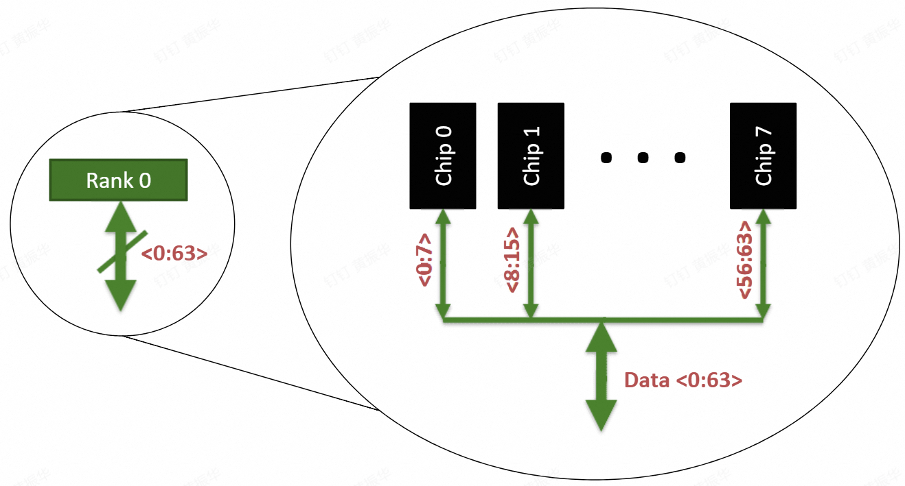
- Chip:
    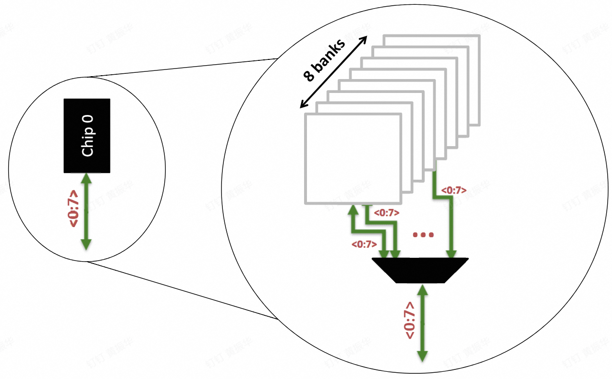
- Bank:
- Row/Column:

# lec 6: GPU's Architecture

# lec 7: GPU's Optimization

# lec 8: Cache
### Memory Hierarchy
- 动机: 速度快的存储器容量小，容量大的存储器速度慢。
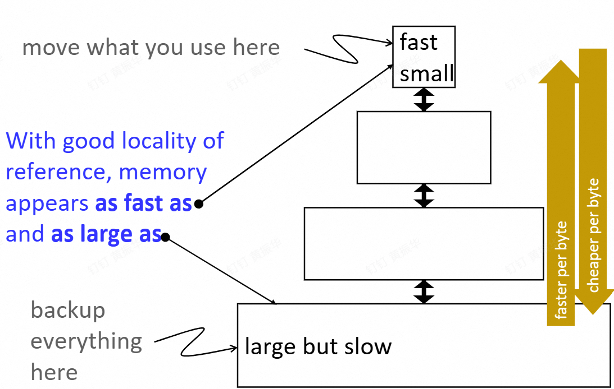

### Locality
- Temporal Locality: 如果一个数据被访问过，那么它很可能在不久的将来再次被访问。
- Spatial Locality: 如果一个数据被访问过，那么它附近的数据很可能在不久的将来被访问。

### Caching Basics
**Expoiting Temporal Locality**
- idea: 将最近访问过的数据储存在一个 automatically managed fast memory（cache）中，以便快速访问。

**Expoiting Spatial Locality**
- idea: store data in addresses adjacent to the recently accessed one in automatically-managed fast memory
    - 将 memory 分成多个 equal-sized blocks
    - 当访问一个 block 时，将整个 block 载入 cache 中

**Cache Block(Line)**: unit of storage in cache
- Memory 被划分为多个 blocks，匹配 Cache 中的 block

- HIT: 数据在 cache 中找到，直接使用而不访问 memory
- MISS: 数据不在 cache 中，载入 block 到 cache 中，可能需要替换掉一个已有的 block

**高缓存命中率**：
- Placement：在哪里放置数据块/如何找到
    - Direct-mapped：每个 chunk 只能放在 cache 中的一个 block
    - Fully associative：每个 chunk 可以放在 cache 中的任意 block
    - Set associative：每个 chunk 可以放在 N-way associative cache 中的 N 个 block 中的任意一个
    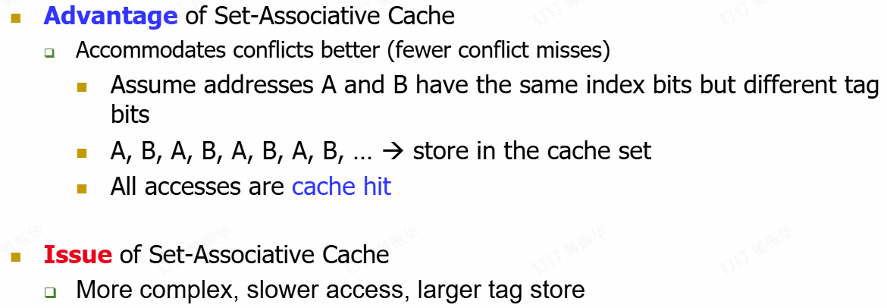

- Replacement：当 cache 满时，替换哪个数据块
    1. invalid block first
    2. if all valid, consult replacement policy
        - LRU: Least Recently Used
        - FIFO: First In First Out
        - Random: 随机选择一个 block 替换

- Granularity of management：block 的大小，是否需要 subblock

- Write policy：写回（write-back）还是直写（write-through）
    Where to write? 2 steps:
    1. if not in cache, either works:
        - Write-allocate: load the block into cache, then write to it
        - Write-no-allocate: write directly to memory, don't load into cache

    2. if in cache, either works:
        - Write-back: write to cache and wait until block is replaced to write to memory
        - Write-through: write to both cache and memory immediately
    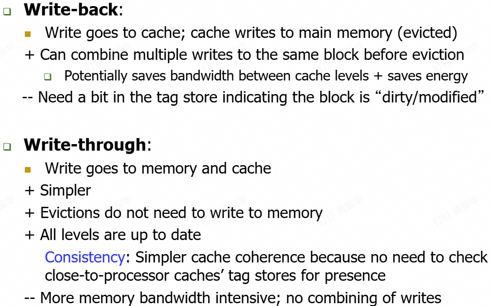

- Instructions vs. Data：指令和数据是否分开缓存

# lec 9: Cache Coherence
**Coherence (一致性)**: 确保同一个内存地址（Location）在所有核心的 Cache 中看到的值是一致的。它解决的是“局部”的私有缓存同步问题。
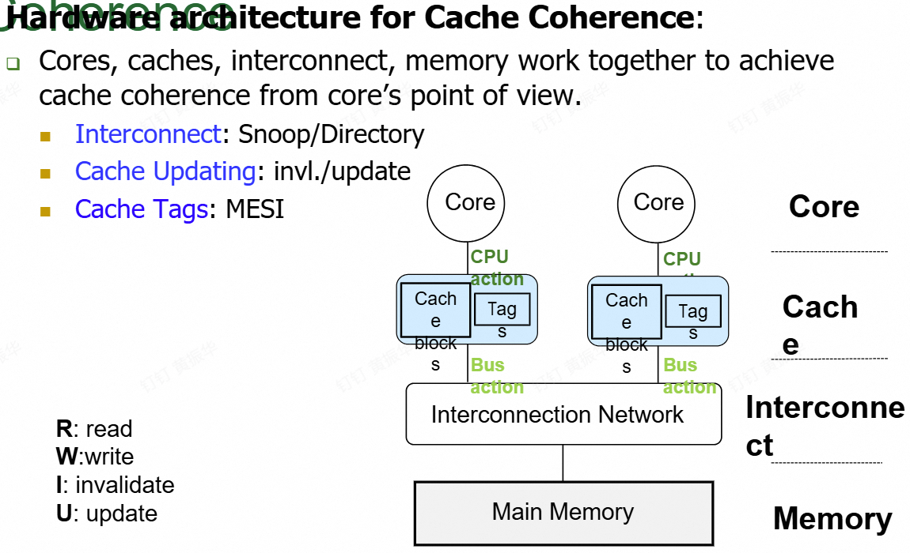

### Protocols
**Snoop**: Bus-based, each bus action broadcasts on the bus, one action at a time

- Single point of serialization for all memory requests (全局串行化点)： 因为所有的内存请求都必须通过这条共享总线来广播，总线就成为了一个全局的仲裁者。所有核心看到的总线事务顺序是完全一致的，这就天然地实现了全局操作的串行化（Serialization）

**Directory**: 为每个内存块维护一个目录，跟踪哪些核心拥有该块的副本，和他们的读写权限。核心在访问内存块时，先查询目录以确定是否需要进行一致性操作。

- Directory coordinates invalidation and updates (协调作废与更新)： 当核心 A 想要修改数据时，目录会查看记录，发现核心 B 和 C 也缓存了该数据。此时，由目录精准地向核心 B 和 C 发送作废（Invalidation）或更新消息，而不需要骚扰其他无关的核心。

### Updating Policy
Safely update replicasted data in other caches.
**Update Protocol**: 在总线上向所有缓存广播更新数据的值，而不是作废它们的副本。这样，其他核心可以直接使用最新的数据，而不需要再次从内存中读取。

**Invalidate Protocol**: 当一个核心想要写入数据时，它会向其他核心发送作废信号，通知它们丢弃该数据的副本。这样，其他核心在下一次访问该数据时，会发现它们的副本已经无效，从而从内存中获取最新的数据。

**MSI Protocol**: 每个缓存块有三种状态：
- M (Modified): 唯一副本，core can read/write w/o bus
- S (Shared): 共享副本，local core can read, but not write
- I (Invalid): block 不在 cache 中，core must fetch from memory or other cache

problems: 对于独占数据（读入时默认标记为 S），核心想要写入时（S -> M）会x向总线广播 Invalidate 信号，但这是多余的，浪费总线带宽。

**MESI Protocol**: 在 MSI 的基础上增加了一个状态：
- E (Exclusive): 唯一副本，clean，core can read/write w/o bus
其实就是把 S 状态变成唯一副本。

# lec 10: Memory Consistency
**Consistency (连贯性)**: 确保不同的内存地址在多线程并发读写时的执行顺序（Ordering）符合预期。它解决的是“全局”的内存行为可见性规则

**Memory Barrier**: 需要保证前面的操作在后面的操作之前完成
- Load-Load
- Load-Store
- Store-Store
- Store-Load

**Consitence Models**: 
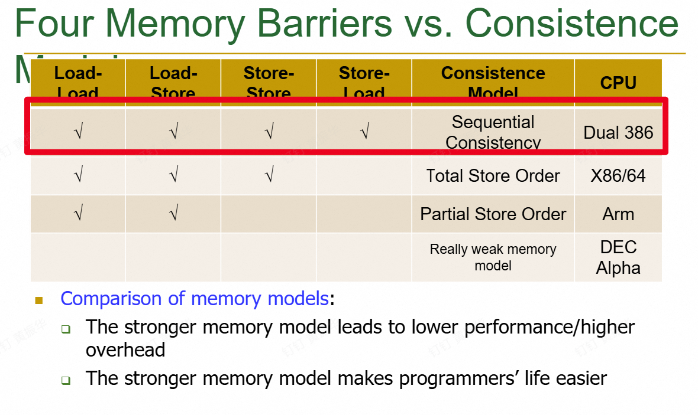

# lec 11: Accelerator Motivation
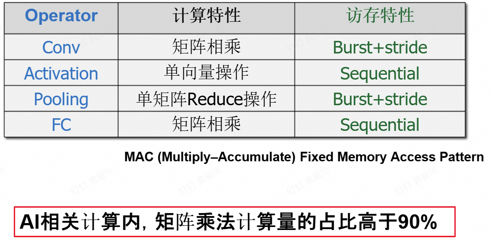

### Five design principles
1. **Global Buffer**:使用专有的存储器来减少数据搬运的距离与开销，比如
将复杂的cache设计替换成scratchpad memory (global buffer)

2. **简化控制模块**: 将缩减的高级微架构特性而节省出的面积，用于增加更多
的运算单元或者片上存储。

3. **并行计算模块**: 使用能够符合特定领域加速需求最简单的并行形式，例如，
对于矩阵运算的加速，单条指令直接支持小矩阵运算

4. **量化**: 减少计算数据尺寸与类型来符合特定领域性能要求，例如，深度学
习中，推理可以采用int8量化方式进行

5. **专用编程语言**: 使用DSA专用语言进行编程

# lec 12: Davinci and Tpu

# lec 13: CANN and MindSpore

# lec 14: Parallel Training

# lec 15: Flash Attention